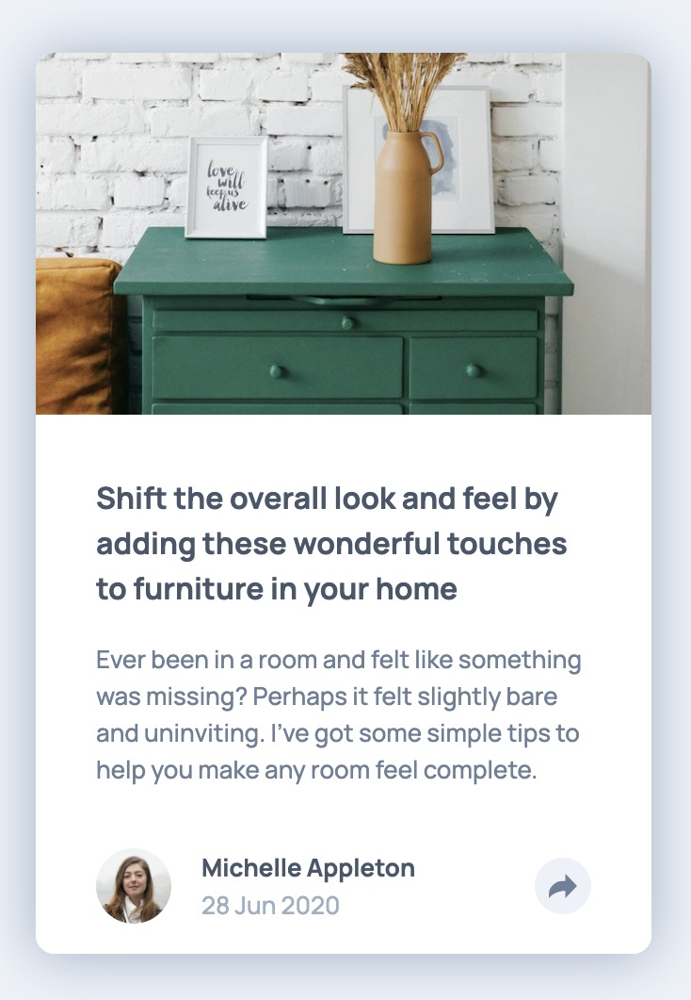
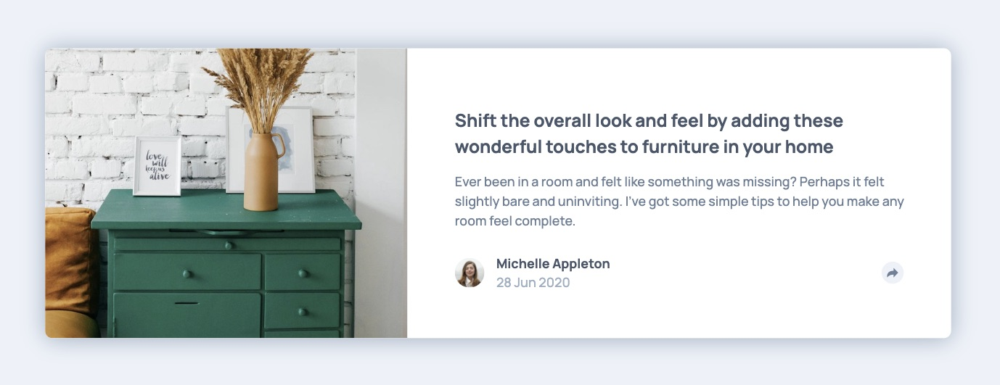

# Frontend Mentor - Article preview component solution

This is a solution to the [Article preview component challenge on Frontend Mentor](https://www.frontendmentor.io/challenges/article-preview-component-dYBN_pYFT). Frontend Mentor challenges help you improve your coding skills by building realistic projects.

## Table of contents

-   [Overview](#overview)
    -   [The challenge](#the-challenge)
    -   [Screenshot](#screenshot)
    -   [Links](#links)
-   [My process](#my-process)
    -   [Built with](#built-with)
    -   [What I learned](#what-i-learned)
    -   [Continued development](#continued-development)

## Overview

### The challenge

Users should be able to:

-   View the optimal layout for the component depending on their device's screen size
-   See the social media share links when they click the share icon

### Screenshot




### Links

-   Solution URL: [Add solution URL here](https://your-solution-url.com)
-   Live Site URL: [Add live site URL here](https://your-live-site-url.com)

## My process

### Built with

-   Semantic HTML5 markup
-   CSS custom properties
-   Flexbox
-   Mobile-first workflow

### What I learned

I learned how to toggle the visibility of the tooltip or social media icons by clicking the share button. Instead of using a toggle function, I implemented this behavior using CSS. Additionally, it was challenging to make the same button perform different operations depending on the device size.

```html
<div id="mobile-active-footer">
    <p class="share">Share</p>
    <div class="social-media">
        
        
        
    </div>
</div>
```

```css
#mobile-active-footer {
    display: none;
}
#mobile-active-footer.visible {
    display: flex;
    ...;
}
```

```js
shareButton.addEventListener("click", () => {
    const isMobile = window.innerWidth <= 768;

    if (isMobile) {
        const isActiveMobile = activeFooter.classList.contains("visible");
        if (isActiveMobile) {
            activeFooter.classList.remove("visible");
            profile.classList.remove("hidden");
            ...
        } else {
            activeFooter.classList.add("visible");
            profile.classList.add("hidden");
            ...
        }
```

### Continued development

I plan to keep exploring more features of JavaScript and continue improving my coding skills.
# article-preview-component-master
